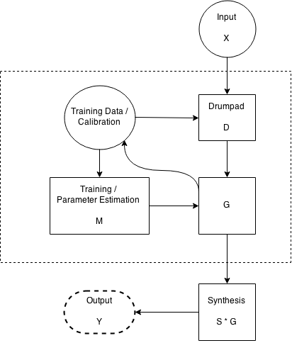
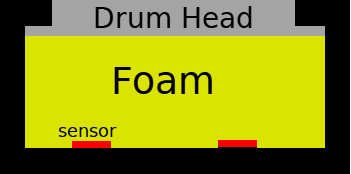
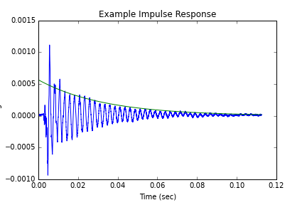
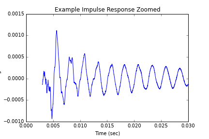
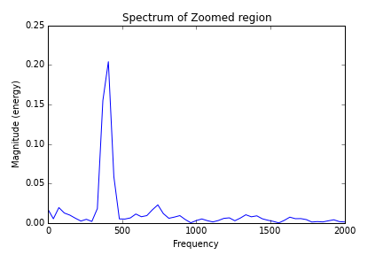

# Introduction

# Design of Drumpad & Instrumentation

 

 

# Analysis of Drumpad Properties

## Theory

TODO: redo theory with coulomb damping instead of viscous damping
TODO: actually, just show that the difference is negligible ish

### Drum Head Vibrations

> $(\delta_r^2 + \frac{1}{r}\delta_r + \frac{1}{r^2}\delta_{\theta}^2) u = \frac{1}{c^2}\left(
\delta_t^2 + 2 \gamma \delta_t \right)u$

Where $r, \theta$ are cylindrical coordinates, $a$ is the damping coeff, and $c$ is the speed of sound for the material.

> $u_{mn}(r, \theta, t) = J_m(\lambda_{mn}r)[a_{mn}\cos(m \theta) + b_{mn}\sin(m\theta)] \cos{(t\sqrt{c^2 \lambda_{mn}^2 - \gamma^2})}\exp(-\gamma t)$

> $u(r, \theta, t) = \sum_{m=0} \sum_{n=1} u_{nm}$

- $\lambda_{mn} = \alpha_{mn}/R$
  - $\alpha_{mn}$ is the $n$th root of $J_m$

> $c = \sqrt{\frac{N^{*}_{rr}}{\rho h}}$
 
 - $c$ is the speed of sound in the medium
 - $h\equiv$ thickness
 - $N^{*}_{rr} \equiv$ is the radial membrane resultant on $\delta \Omega$
 - $\gamma$ is the attenuation factor
 
 For uniform tension:
 
> $c = \sqrt{\frac{T}{\rho h}}$
 
 - $T =$ Tension

- Fixing $\theta$ and $r$, modes are sinusoids decaying as $\exp(-\gamma t)$

- Varying $r$ and fixing $\theta$ and $t$ should result in Bessel functions

- Varying $\theta$ and fixing $t$ and $r$ should give sinusoids 

### Damping and its effects on Ray Tracing and Time Delay of Arrival

> (@T_1) $T(\Delta) = \frac{1}{c_{2}} \sqrt{\Delta^{2} + h^{2}} + \frac{1}{c_{1}} \left(- \Delta + x\right)$

> (@dTdH) $\frac{d T}{d \Delta} = \frac{\Delta}{c_{2} \sqrt{\Delta^{2} + h^{2}}} - \frac{1}{c_{1}}$

Solving for roots yields: 

> $\Delta = \left [ - \sqrt{\frac{c_{2}^{2} h^{2}}{\left(c_{1} - c_{2}\right) \left(c_{1} + c_{2}\right)}}, \quad \sqrt{\frac{c_{2}^{2} h^{2}}{\left(c_{1} - c_{2}\right) \left(c_{1} + c_{2}\right)}}\right ]$

We throw out the negative root since $\Delta$ was defined to be positive.

Computing the concavity of the system yields

> (@ddTddH) $\frac{d^2 T}{d^2 \Delta} = - \frac{\Delta^{2}}{c_{2} \left(\Delta^{2} + h^{2}\right)^{\frac{3}{2}}} + \frac{1}{c_{2} \sqrt{\Delta^{2} + h^{2}}}$

Which when evaluated at  $\quad \sqrt{\frac{c_{2}^{2} h^{2}}{\left(c_{1} - c_{2}\right) \left(c_{1} + c_{2}\right)}}$  for reasonable values of $c_1$, $c_2$, and $h$ ($c_1 \gg c_2, h > 0$ yields a positive result implying that this is infact a minima. [^1]

Substituting calculated $\Delta$ into (@T_1) then gives 

> (@T_2) $T = \frac{1}{c_{2}} \sqrt{\frac{c_{1}^{2} h^{2}}{c_{1}^{2} - c_{2}^{2}}} + \frac{x}{c_{1}} - \frac{1}{c_{1}} \sqrt{\frac{c_{2}^{2} h^{2}}{c_{1}^{2} - c_{2}^{2}}}$.

Shuffling terms around gives

> (@T_3) $T = \frac{h}{c_1}(1- \beta^2)^{-1/2}(\beta^{-1} + \frac{x}{h} - \beta)$

- $\beta \equiv \frac{c_2}{c_1}$

Which can be easily identified as a linear relation w.r.t. $x$ 

> (@T_4) $T = b + a x$

- $\gamma \equiv (1 - \beta^2)^{-1/2}$

- $a = \frac{\gamma}{c_1}$

- $b = h(\beta^{-1} - \beta)\frac{\gamma}{c_1}$

Thus, solving for $b$ and $a$ can be done using a linear fit.

Note that $b$ and $a$ are related by a factor of $h (\beta^{-1} - \beta)$

Thus

> $\frac{b}{h a} = \beta^{-1} - \beta$

Multiplying by $\beta$ we get

> $\beta^2 + \frac{b}{h a}\beta - 1 = 0$

Whose roots are

> $\left [ - \sqrt{1 + \frac{b}{a h}}, \quad \sqrt{1 + \frac{b}{a h}}\right ]$

We can throw out the negative result since $c_1 \wedge c_2 > 0$ impling $\beta=c_2/c_1$ is positive.

With $\beta$ estimated, a series of $T(x)$ measurements can be recast as a linear system w.r.t. $\frac{1}{c_1}$ and $\frac{1}{c_2}$

Thus, determining $c_1$ which in turn induces the mode frequencies: $\frac{c}{R} \alpha_{mn}$

More over, for the expected values, $\frac{c_1}{c_2} \approx \frac{1000}{10}$ and $h \approx \frac{1}{10}$m, $\Delta \approx \frac{1}{1000}$ which is less than the diameter of the piezo sensors.

## Measured

### Excited Modes

 

 

 

### Measured Time Delay of Arrival

# Passive Calibration

## Source Localization and Computing the impulse response

## Array Self Localization

# Active Calibration (Piezos as actuators)

# Computing $G$ Using Ideal Impulse Response

# Computing $G$ Using Markov Chains

# Issues and Potential Solutions

# Future Work

# Conclusion
