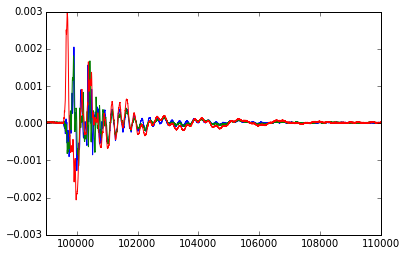
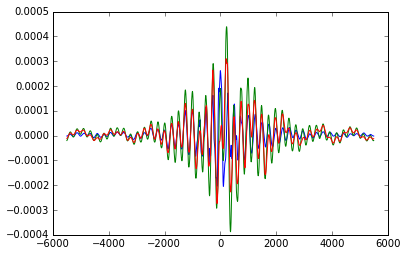

# Introduction

In this paper we explore the effects of introducing a foam waveguide into the cavity
of hybrid acoustic drums. First we shall give some properties that motivate the use of 
foam waveguides for drumpads (and potentially other human interface devices). Then
to concretely illustrate these benefits, a preliminary design of a system exploiting these
effects is developed. Next the design's theoretical properties are explored and tested.
We then develop software techniques for automatically calibrating such a system to then
recover to input signal. This signal could then be convolved with another drum's impulse
response to replicate the sound of that drum being driven instead. Finally, we shall 
explore issues with technique and avenues for future research.

# Motivations

The motivations for studying foam waveguides include lowering the intensity of the sound produced, 
eliminating echos, and using lower sample rates. Let us quickly explore why these are desirable 
properties.

## Lowering the Signal Intensity

The advantages of lowering the signal intensity at numerous. One might imagine such a drum
pad being used in an apartment complex where the surrounding communities ambient noise is 
heavily regulated. Additionally, as with wireless radios, lowering intensity signals can be
in closer proximity to each other without effecting the quality of the communications. Here
cross talk might result from a sound wave propagating into a nearby instrument. With the 
introduction of damping in both instruments, not only is the initial sound wave lower 
intensity, but if it reaches a nearby instrument, it is further attenuated before reaching 
the sensors.

## Eliminating Echos

The attenuation also helps eliminate unwanted signals reflected from the boundary (which may be thought of 
as sources at mirror locations). Indeed, with sufficient damping, time delay of arrival estimates can safely
ignore the possibilities of echos.

## Lowering Sample Rates

Finally, many of the techniques for calibration and localization utilize time delay of arrive. As we shall see
the introduction of damping by filling the cavity with a high density polymer foam and placing the sensors inside
the foam significantly lowers the wave speed. While this does not affect the frequency of the waves and thus the 
capturing of the signal's structure (modulo frequency dependent attenuation), it does decrease the minimal sample
rate for accurately computing the time delay of arrival. This enables the use of cheaper sensors for calibration
and localization.

# Design of Drumpad & Instrumentation

Many of the techniques discussed in this paper were motivated by Roberto Aimi's work on real-time convolution in percussion instruments.
[-@aimi2007percussion] Here, the focus is on drum pads since their dynamics are modeled using simple linear differential equations. This
allows one to estimate the greens function (corresponding to the impulse response) of the system which could be used to deconvolve the
signal to recover the original signal (see figure 3).

## Hardware Design

An image of the drumpad used in the measurements seen later in this paper can be seen in Figure 1. A caricature of the drum is
given in Figure 2. The essential features are a circular membrane pinned down on the boundary. Beneath the membrane is a 
cavity that serves wave guide (with a smaller wave speed) sending the signal to the sensor at the bottom of the cavity.
The foam also applies viscous damping to the drum head as it oscillates.

 

 

The sensors themselves are common pizeo electric PZT ceramic contact mics. While these sensors exhibit hysteresis due to
the lack of inversion symmetry, one the time scales and pressures necessary for this application, the response is linear. 

The signals were detected using a Focusrite Scarlett 18i8 audio interface and the jack2 audio server.

## Software Design

As previously noted, the inspiration for this design comes from Roberto Aimi's PhD Thesis. The key difference is that the 
specialization to drumpads allows us to create a training loop that calibrates or learns the response of the drum.

The ultimate goal, as shown in Figure 3, is to use the drumpad as the input and replicate another drum's response. 
To counteract the filter the drumpad, D, applies to the input, X, we try to design a filter G to be D's inverse. 
This is done by deconvoling (an inverse in frequency space) X with the computed greens function.

The calibration procedure described in this paper estimates the parameters to the theory developed in the next 
section. This procedure heavily relies on time delay of arrival (TDOA) to compute the speed of sound in the 
material and the damping coefficients.

# Theory #

We now turn to an analysis of the drumpad's properties. A few assumptions such as 
uniform tension in the drumhead, uniform density in the polymer foam, and roughly constant
temperature (understanding that attenuation of the wave in the foam waveguide necessitates the 
foam heating up).

## Drum Head Vibrations ##

We begin with the standard wave equation for a 2-d membrane (i.e. the Drum Head) undergoing viscous damping. This derivation is based on [@asmar2005].

(@wave) $(\delta_r^2 + \frac{1}{r}\delta_r + \frac{1}{r^2}\delta_{\theta}^2) u = \frac{1}{c^2}\left(
\delta_t^2 + 2 \gamma \delta_t \right)u$

Where $r, \theta$ are cylindrical coordinates, $\gamma$ is the damping coeff, and $c$ is the speed of sound for the material.

Moreover, we assume uniform tension and a fixed membrane boundary.

As one can easily verify, the general solution to this differential equation under these boundary conditions is an infinite series of
 modes index by $m, n \in \mathbb{N}$.

@mode) $u_{mn}(r, \theta, t) = J_m(\lambda_{mn}r)[a_{mn}\cos(m \theta) + b_{mn}\sin(m\theta)] \cos{(t\sqrt{c^2 \lambda_{mn}^2 - \gamma^2})}e^{(-\gamma t)}$

(@impulse) $u(r, \theta, t) = \sum_{m=0} \sum_{n=1} u_{nm}$

- $\lambda_{mn} = \alpha_{mn}/R$
  - $\alpha_{mn}$ is the $n$th root of $J_m$

- $\gamma$ is defined as the attenuation factor

At this point we can make a few observations regarding the solution

1. Fixing $\theta$ and $r$, modes are sinusoids decaying as $\exp(-\gamma t)$

2. Varying $r$ and fixing $\theta$ and $t$ should result in Bessel functions

3. Varying $\theta$ and fixing $t$ and $r$ should give sinusoids 

During the calibration procedure, one can exploit any of these properties to
estimate $\gamma$ and c (which induces $\omega_{mn} = c \lambda_{mn}$). More
over, these allow one to estimate the currently active modes.

## Is viscous damping really appropriate? ##

The previous derivation of the drum head modes assumed that the drum head undergoes viscous damping.
One may reasonably question the validity of this assumption[^1]. For example, another reasonable 
model for the damping might be coulomb damping since the foam maintains near constant mechanic contact 
with the drum head. Moreover, the damping could include higher order terms resulting in turbulent 
damping. Lastly, because the foam is constructed using polymers the fractional model likely captures 
the intermediate nature between viscous and hysteretic modes.

### Turbulent Damping ###

Let us address each of these concerns. Higher order terms should not dominate in this regime since
no fluids are involved making turbulent effects unlikely. A deeper analysis reveals that even if
there were higher order terms, the non-linearity only emerges when the relative initial conditions 
deviate largely from quiescent conditions (which is not applicable here since this would imply 
the drumhead either deform or tear).

### Coulomb Damping ###

Despite the constant mechanical contact, Coulomb damping would only apply for transverse movements 
of the foam relative to the drum-head. While certainly present, the compressive forces are likely 
to dominate due to the uniform tension assumption and fixed border boundary condition.

### Fractional Damping ###

The most likely candidate for an alternative damping model is fractional damping. Fractional damping
is often used to model polymers which constitute the construction of the foam. These demonstrate a
combination hysteresis and viscosity. [^2]Nevertheless, the hysteretic effects are likely on the order of
similar non-linearities in the piezo contact mics.

Finally, as we shall see in the measurements section, the empirical results fit a viscous damping model.
An important consequence of this is that the linearity of the viscous damping model allows the input signal
to be effientially estimated using the green's function.

## Damping and its effects on Ray Tracing and Time Delay of Arrival ##

We now turn to the effect of the foam waveguide on the time delay of arrival. Because the wave guide has a 
significantly lower wave speed than the membrane, the wave will travel mostly on the surface before entering the waveguide 
and traveling to the sensor. This is illustrated in figure 4. We now wish to estimate the offset in position a time 
delay of arrival would yield in the situation.

First, note that the time between the impulse and it's arrival is given by

> (@T_1) $T(\Delta) = \frac{1}{c_{2}} \sqrt{\Delta^{2} + h^{2}} + \frac{1}{c_{1}} \left(- \Delta + x\right)$

The derivative w.r.t. $\Delta$ is then

> (@dTdH) $\frac{d T}{d \Delta} = \frac{\Delta}{c_{2} \sqrt{\Delta^{2} + h^{2}}} - \frac{1}{c_{1}}$

Solving for roots yields: 

> $\Delta = \pm \sqrt{\frac{c_{2}^{2} h^{2}}{\left(c_{1} - c_{2}\right) \left(c_{1} + c_{2}\right)}}$

We throw out the negative root since $\Delta$ was defined to be positive.

Computing the concavity of the system yields

> (@ddTddH) $\frac{d^2 T}{d^2 \Delta} = - \frac{\Delta^{2}}{c_{2} \left(\Delta^{2} + h^{2}\right)^{\frac{3}{2}}} + \frac{1}{c_{2} \sqrt{\Delta^{2} + h^{2}}}$

Which when evaluated at  $\quad \sqrt{\frac{c_{2}^{2} h^{2}}{\left(c_{1} - c_{2}\right) \left(c_{1} + c_{2}\right)}}$  for reasonable values of $c_1$, $c_2$, 
and $h$ ($c_1 \gg c_2, h > 0$ yields a positive result implying that this is infact a minimum.

Substituting calculated $\Delta$ into (@T_1) then gives 

> (@T_2) $T = \frac{1}{c_{2}} \sqrt{\frac{c_{1}^{2} h^{2}}{c_{1}^{2} - c_{2}^{2}}} + \frac{x}{c_{1}} - \frac{1}{c_{1}} \sqrt{\frac{c_{2}^{2} h^{2}}{c_{1}^{2} - c_{2}^{2}}}$.

Shuffling terms around yields

> (@T_3) $T = \frac{h}{c_1}(1- \beta^2)^{-1/2}(\beta^{-1} + \frac{x}{h} - \beta)$

- $\beta \equiv \frac{c_2}{c_1}$

Which can be easily identified as a linear relation w.r.t. $x$ 

> (@T_4) $T = b + ax$

- $\gamma \equiv (1 - \beta^2)^{-1/2}$

- $a = \frac{\gamma}{c_1}$

- $b = h(\beta^{-1} - \beta)\frac{\gamma}{c_1}$

Thus, solving for $b$ and $a$ can be done using a linear fit.

Note that $b$ and $a$ are related by a factor of $h (\beta^{-1} - \beta)$

Therefore,

> $\frac{b}{h a} = \beta^{-1} - \beta$

Multiplying by $\beta$ we get

> $\beta^2 + \frac{b}{h a}\beta - 1 = 0$

Whose roots are:

> $\pm \sqrt{1 + \frac{b}{a h}}$

We can again throw out the negative result since $c_1 \wedge c_2 > 0$ implying $\beta=c_2/c_1$ is positive.

With $\beta$ estimated, a series of $T(x)$ measurements can be recast as a linear system w.r.t. $\frac{1}{c_1}$ and $\frac{1}{c_2}$

Thus, determining $c_1$ which in turn induces the mode frequencies: $\frac{c}{R} \alpha_{mn}$

More over, for the expected values, $\frac{c_1}{c_2} \approx \frac{1000}{10}$ and $h \approx \frac{1}{10}$m, $\Delta \approx \frac{1}{1000}$ which is less than the diameter of the piezo sensors.

# Measurements on real drumpad #

We now turn to some empirical results collected on the prototype.[-@dataset]

## Excited Modes ##

Figures 5 and 7 illustrate the striking the drum pad at location 15. (see figure 1)
Note that the transient quickly dies away (0.006 sec). Furthermore, most of the higher
steady state modes attenuate away by 0.015 sec. After this point the signal
behaves as if only mode is active (See figure 8).

 

 

 

## Measured Time Delay of Arrival ##

 

 

Here we examine one of the impulses just over sensor 1. (See figure 1 there are 3 sensors).

Computing the TDOA yields 

- 252.5 sample delay between sensor 1 and 2
- 247.5 sample delay between sensor 1 and 3
- 1.5 sample delay between sensor 2 and 3

The sample rate here was 96 kHz, at a lower frequency the delay between 2 and 3 would be indistinguishable. This suggests that in the future we should use a more porous foam with a slower wave speed.

Inserting the distances between each sensor this yields an approximate wave speed of $43$ m/s[^3]. 
We have indeed succeeded in decreasing the wave speed dramatically. At higher wave speeds TDOA becomes
prohibitive.

# Calibration

With the theory in place and real world measurements backing up the soundness of many of 
the assumptions, we now shift focus to calibrating the instrumentation automatically. The 
key requirements to localize the microphone array relative to each other (either by direct 
measurement or array self localization), compute the relevant parameters for calculating
the forcing based on the signal. The primary method described builds on the theory developed so
far to compute the greens function of the system from the wave speed and damping coefficients. In
practice, one can choose the materials and have strong priors for these quantities parameters at a given
temperature.

## Feasibility of measuring signal

Recall from figure 8, that the dominating modes exist under $1$ kHz. The Arduino API reference [-@ArduinoReference]
specifies that an analogRead takes about 100 microseconds ($10^{-4} s$) allowing use to easily measure the relevant modes.

## Feasibility of computing wave speed

The problem then lies in computing and estimating the wave speed of the material (to estimate which modes correspond to 
which frequencies or equivalently, to localize the forcing). As seen in the Measured Time Delay of Arrival section, 
the introduction of damping decreases the wave speed from $\approx 1000 m/s$ (typical of solids) to $\approx 40 m/s$
(characteristic of porous absorbers like the foam used). Thus, the time resolution required to measure the waves 
difference in arrival over 4" (the smallest diameters typically seen in drum heads) is only $\approx 
\frac{1}{4}\frac{1}{100} s$. This is a huge window when compared with the undamped TDOA window of $\frac{1}{2}10^{-4} 
s$ which is on the same order as the time it takes to get an analog measurement on the Arduino. Therefore, 
linear least squares fitting described in the ray tracing segment can be used to compute both the wave speed of the
foam, but also the wave speed of the drum head.

## Source Localization

For completeness we provide a reference to array self localization (@handbook). This technique gives the relative
position of the sensors. We must then apply a known scale (say the radius of the drum head). Using this information
the sensor locations can be automatically computed. This could be particularly useful in a consumer kit sold
to convert an existing drum into a hybrid acoustic instrument. Calibration would then just

# Piezos as actuators to calibrate modes

Another technique work mentioning (but not actively explored here) is actuated the piezos using a known
aperiodic signal (as to have a clear start and end point) and empirically measure the filter between
it and other sensors. For reasonably dense sensor arrays, this could give a very good estimate for the 
greens function. The sensors themselve could still be localized using as in the previous section, but
the computation of the greens function would be more robust to variations in drum design.

# Issues, Potential Solutions and Future work

## Waves traveling on the boundary

Although not shown here, waves that travel near the boundary may take a shortcut through the rim of the material
into the material casing and then traveling to the sensor. This indirect route is undesirable. One potential solution 
is to actually embedded the sensor arrays into the foam waveguide. This means that the wave must travel through the 
foam independent of path. Then, one could make the foam near the edges and bottom of the wave guide less dense 
(or some more complicated pattern) that has an even higher attenuation rate and slower wave speed.

## Changes in tempature and loss of tension

Just as in any normal instrument, keeping the instrument in-tune will be essential for this system. 
That said, unlike most other instruments, this system provides a means for either adapting the new
configuration or indicating that it out of tune (potentially advising how to remedy the tuning).

One can conceive of putting in tempature sensors which allow tempature dependent changes to be accounted for.
Alternatively, one might implement a more sophisticated TDOA analysis for detecting non-uniform tension
(via the distribution of computed wave speeds).

## Greens function

Mostly due to time constraints, a proper derivation of the greens function of this wave guide has been omitted.
The Stokes Equation is likely applicable, but more investigation is needed.

## Combining these insights with Synthesis

Lastly, the ultimate goal of such endeavors is to synthesis beats produced by these drum pads.
Many empirical and theoretical models for other drums exist and convolution with these models
is a natural next step. 

# Conclusion

In this paper we have demonstrated the utility of introducing a foam waveguide between the drum head and the sensors.
The immediate results include eliminating echos due to attenuation, slowing the wave speed and thus enabling 
time delay of arrival on reasonable equipment, and demonstrating that for sufficently slow mediums the error
in TDOA incurred by alternative wave paths is small. The building blocks for a prototype system are then developed.
We explore the resulting modes, and confirm experimentally that the foam serves to viciously damp the system.

# References

[^1]: Indeed, the idea of viscous damping invokes imagery of drum filled entirely submerged in molasses.

[^2]: The effect itself owing to the thermal/statistical nature of polymer chain length.

[^3]: Not shown here (but in the data) are some tests to calculate the speed of sound in the foam. The result yields about 10 m/s
